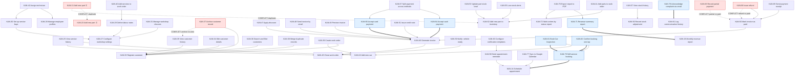

# Lateral Traceability — Mermaid Graph

*Arrow styles: `-->` Dependency | `==>` Refinement | `-.->` Conflict*

```mermaid
graph TD

  %% ── Nodes ──────────────────────────────────────────────────────────────
  KAN13["KAN-13 Add new part ①"]
  KAN22["KAN-22 Add new car"]
  KAN23["KAN-23 Add new part ②"]
  KAN24["KAN-24 Schedule appointment"]
  KAN25["KAN-25 View service history"]
  KAN26["KAN-26 Monthly revenue report"]
  KAN27["KAN-27 Configure workshop settings"]
  KAN28["KAN-28 Manage employee profiles"]
  KAN29["KAN-29 Define labour rates"]
  KAN30["KAN-30 Set up service bays"]
  KAN31["KAN-31 Manage workshop closures"]
  KAN33["KAN-33 Register customer"]
  KAN34["KAN-34 Edit customer details"]
  KAN35["KAN-35 View customer history"]
  KAN36["KAN-36 Search and filter customers"]
  KAN37["KAN-37 Archive customer record"]
  KAN38["KAN-38 Merge duplicate records"]
  KAN39["KAN-39 Create work order"]
  KAN40["KAN-40 Add services to work order"]
  KAN41["KAN-41 Add parts to work order"]
  KAN42["KAN-42 Assign technician"]
  KAN45["KAN-45 Close work order"]
  KAN46["KAN-46 Generate invoice"]
  KAN47["KAN-47 Apply discount"]
  KAN48["KAN-48 Send invoice by email"]
  KAN49["KAN-49 Preview invoice"]
  KAN50["KAN-50 Mark invoice as paid"]
  KAN51["KAN-51 Issue credit note"]
  KAN52["KAN-52 Add new part to inventory"]
  KAN53["KAN-53 Update part stock level"]
  KAN55["KAN-55 Low-stock alerts"]
  KAN56["KAN-56 Record stock adjustment"]
  KAN57["KAN-57 View stock history"]
  KAN58["KAN-58 Send appointment reminder"]
  KAN59["KAN-59 Notify: vehicle ready"]
  KAN61["KAN-61 Log communication history"]
  KAN63["KAN-63 Configure notification templates"]
  KAN64["KAN-64 Accept cash payment"]
  KAN65["KAN-65 Accept card payment"]
  KAN66["KAN-66 Record partial payment"]
  KAN67["KAN-67 Split payment across methods"]
  KAN68["KAN-68 Issue refund"]
  KAN69["KAN-69 Send payment receipt"]
  KAN71["KAN-71 Revenue summary report"]
  KAN72["KAN-72 Work orders by status report"]
  KAN76["KAN-76 Export report to PDF"]
  KAN77["KAN-77 Sync to Google Calendar"]
  KAN78["KAN-78 Acknowledge complaint via email"]
  KAN79["KAN-79 Self-service booking"]
  KAN81["KAN-81 Book Car Inspection"]
  KAN82["KAN-82 Confirm booking one tap"]

  %% ── Dependencies ────────────────────────────────────────────────────────
  KAN39 --> KAN33
  KAN39 --> KAN22
  KAN46 --> KAN45
  KAN41 --> KAN52
  KAN40 --> KAN29
  KAN42 --> KAN28
  KAN42 --> KAN30
  KAN50 --> KAN46
  KAN47 --> KAN46
  KAN48 --> KAN46
  KAN49 --> KAN46
  KAN51 --> KAN46
  KAN68 --> KAN50
  KAN69 --> KAN50
  KAN55 --> KAN52
  KAN53 --> KAN52
  KAN57 --> KAN56
  KAN58 --> KAN24
  KAN77 --> KAN24
  KAN59 --> KAN45
  KAN63 --> KAN58
  KAN25 --> KAN22
  KAN25 --> KAN45
  KAN82 --> KAN79
  KAN81 --> KAN22
  KAN76 --> KAN71
  KAN76 --> KAN72
  KAN34 --> KAN33
  KAN35 --> KAN33
  KAN36 --> KAN33
  KAN37 --> KAN33
  KAN38 --> KAN33
  KAN29 --> KAN27
  KAN30 --> KAN27
  KAN31 --> KAN27
  KAN67 --> KAN64
  KAN67 --> KAN65

  %% ── Refinements ─────────────────────────────────────────────────────────
  KAN79 ==> KAN24
  KAN81 ==> KAN79
  KAN82 ==> KAN79
  KAN71 ==> KAN26
  KAN78 ==> KAN61
  KAN64 ==> KAN46
  KAN65 ==> KAN46

  %% ── Conflicts ────────────────────────────────────────────────────────────
  KAN13 -.->|CONFLICT: duplicate| KAN23
  KAN13 -.->|CONFLICT: duplicate| KAN52
  KAN66 -.->|CONFLICT: partial vs paid| KAN50
  KAN37 -.->|CONFLICT: archive vs view| KAN35
  KAN68 -.->|CONFLICT: refund vs paid| KAN50

  %% ── Styles ───────────────────────────────────────────────────────────────
  classDef conflict fill:#ffe0e0,stroke:#cc0000
  classDef refinement fill:#e0f0ff,stroke:#0055cc
  class KAN13,KAN23,KAN66,KAN37,KAN68 conflict
  class KAN79,KAN81,KAN82,KAN71,KAN78,KAN64,KAN65 refinement
```
