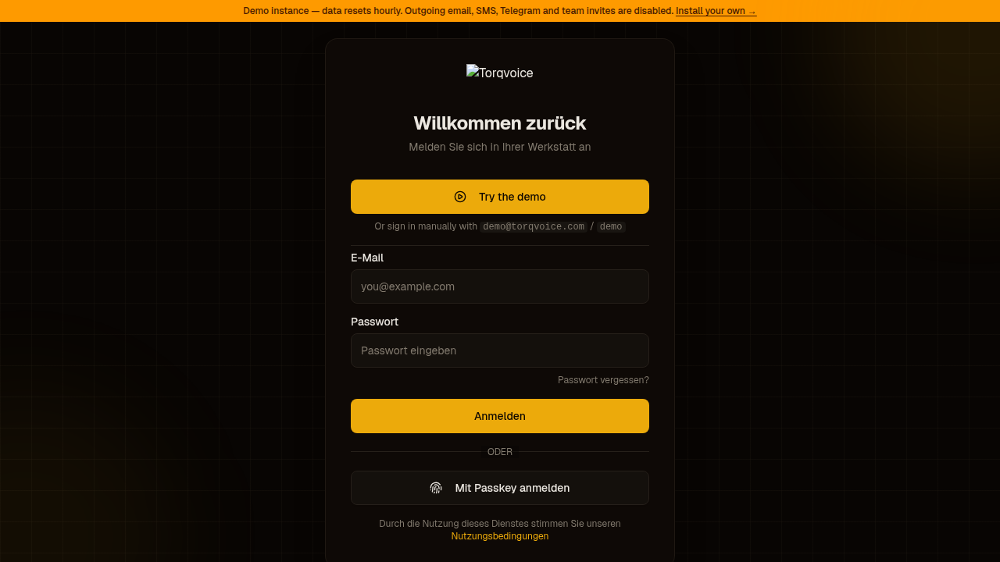
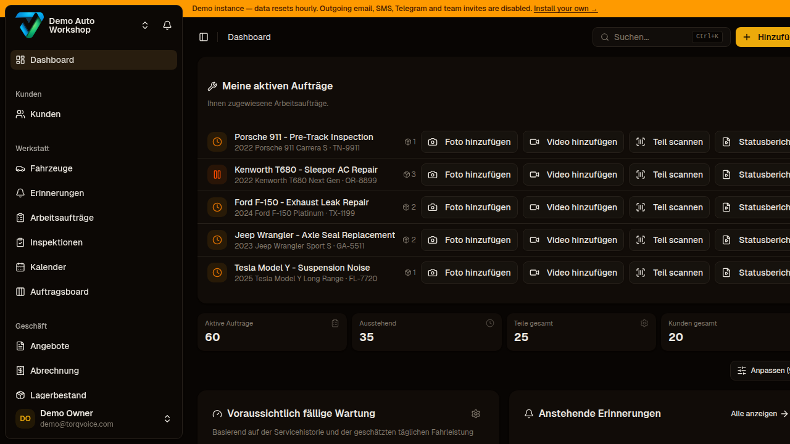
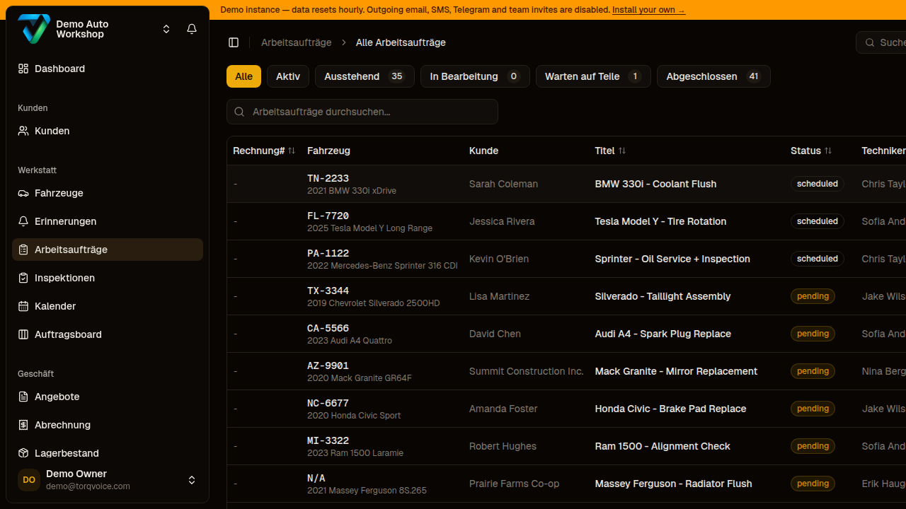
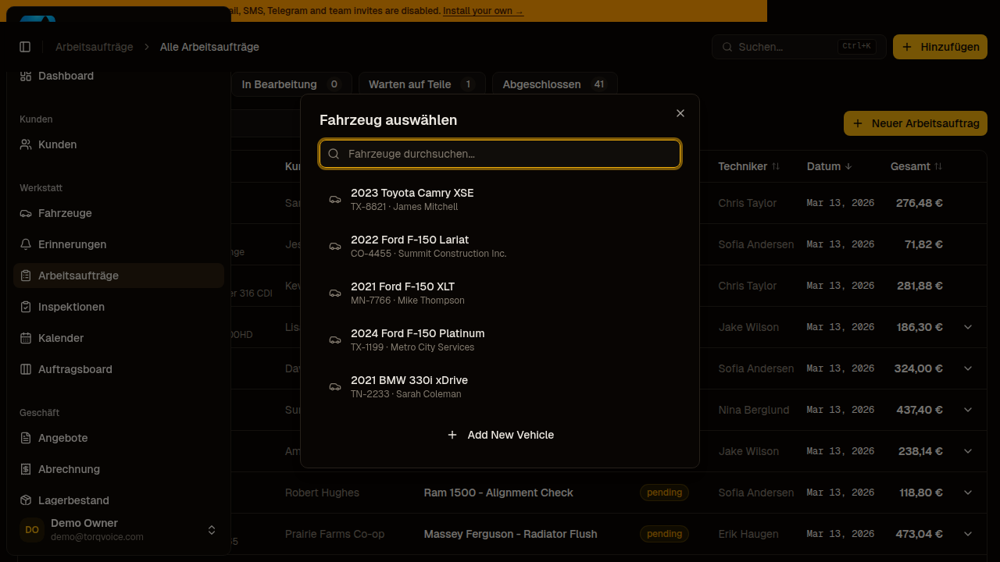
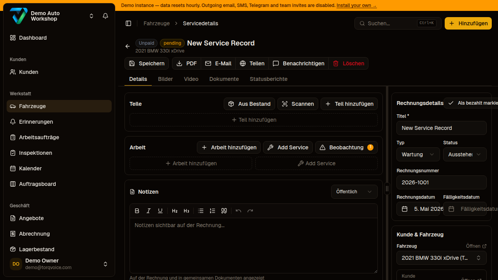
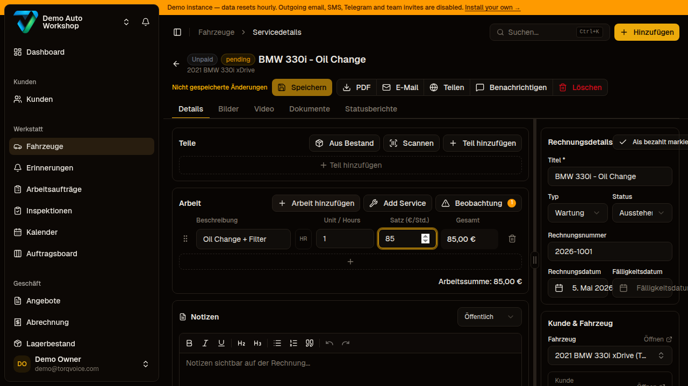
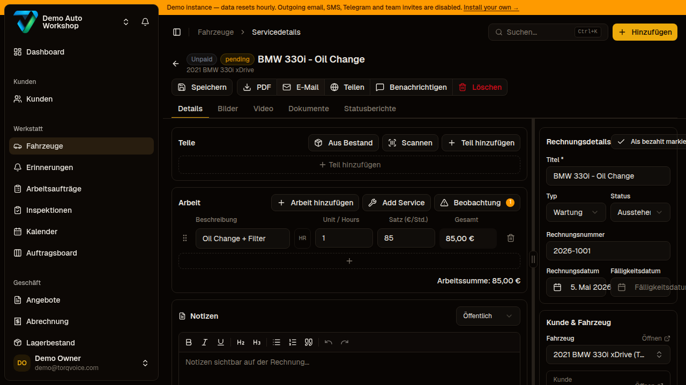
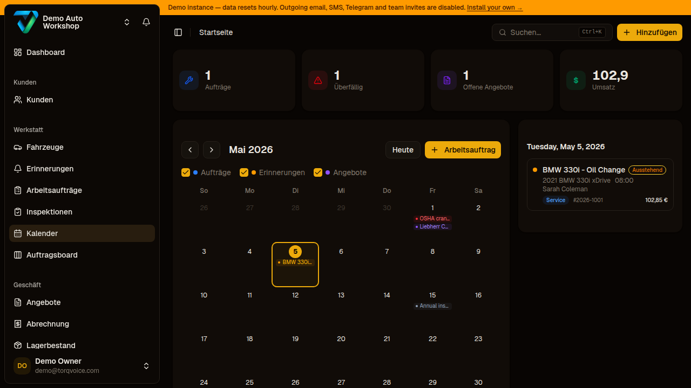
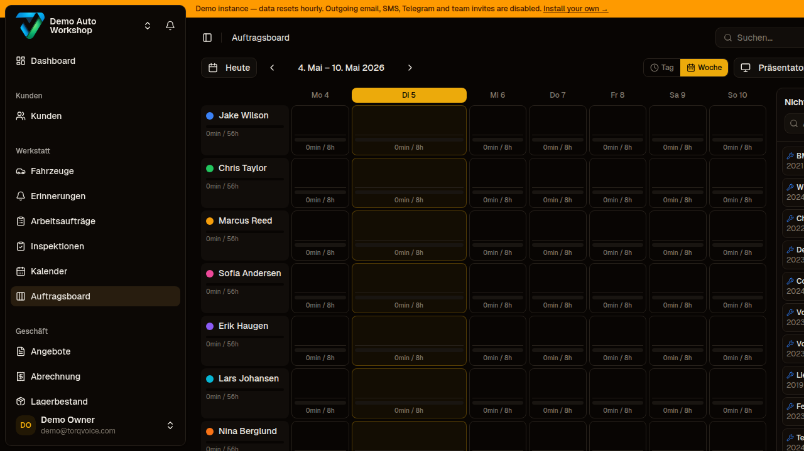

# Torqvoice — Booking Flow Screen Documentation

*Captured via Playwright against https://demo.torqvoice.com/ — 5 May 2026.*
*UI language: German (demo instance). English translations provided in brackets.*

---

## Screen Descriptions

### Screen 1 — Login (`/auth/sign-in`)


The user sees the Torqvoice sign-in page with email/password fields and can log in manually or click **"Try the demo"** to authenticate instantly with demo credentials.

---

### Screen 2 — Dashboard (`/`)


After login the user lands on the main dashboard, which shows a sidebar navigation grouped into **Kunden** (Customers), **Werkstatt** (Workshop), and **Geschäft** (Business), plus a global search bar and a summary of recent activity.

---

### Screen 3 — Work Orders List (`/work-orders`)


The user sees a paginated table of all work orders (101 total), filterable by status (Alle / Aktiv / Ausstehend / In Bearbeitung / Warten auf Teile / Abgeschlossen), searchable by vehicle/customer, and can click **"Neuer Arbeitsauftrag"** [New Work Order] to start the creation flow.

---

### Screen 4 — Vehicle Picker (dialog, triggered from Work Orders)


Clicking "New Work Order" opens a modal dialog **"Fahrzeug auswählen"** [Select Vehicle] where the user can search across all registered vehicles and pick one, or click **"Add New Vehicle"** to register a new vehicle before continuing.

---

### Screen 5 — New Work Order Form (`/vehicles/:id/service/:id`)


After selecting a vehicle (2021 BMW 330i xDrive / Sarah Coleman), the user sees a pre-created service record with two-column layout: left side has **Parts**, **Labour**, **Notes**, and **Payments**; right side has **Invoice Details** (title, type, status, invoice number, dates), **Customer & Vehicle**, **Schedule** (technician, start/end time, duration presets: 1h / 2h / 4h / 5h / 7h), and **Totals**. The record is auto-saved as "pending".

---

### Screen 6 — Work Order Form — Labour Entry


After clicking **"Arbeit hinzufügen"** [Add Labour], an inline row appears in the Labour section where the user types a description, enters hours and hourly rate; the total updates live. Parts can similarly be added from inventory, by barcode scan, or manually.

---

### Screen 7 — Saved Work Order


After clicking **"Speichern"** [Save], the work order is persisted with the labour line visible, invoice summary updated (subtotal, tax at 21%, total), and action buttons available: **PDF**, **E-Mail**, **Teilen** [Share], **Benachrichtigen** [Notify customer], **Löschen** [Delete].

---

### Screen 8 — Calendar (`/calendar`)


The calendar view shows all scheduled work orders as time-blocked events, giving a visual overview of workshop capacity by day — this is where technicians and advisors can see at a glance what is booked and when.

---

### Screen 9 — Work Board (`/work-board`)


The Kanban-style work board shows work orders grouped by status column (Ausstehend / In Bearbeitung / Warten auf Teile / Abgeschlossen), allowing technicians and advisors to drag cards between columns to update job status in real time.

---

## Process Flow — Service Booking in Torqvoice

```
[Start]
   │
   ▼
1. Staff logs in → Dashboard
   │
   ▼
2. Navigate to Work Orders list
   │
   ▼
3. Click "New Work Order"
   │
   ▼
4. Vehicle picker dialog opens
   │
   ├─ Vehicle exists? ──Yes──▶ Select from list
   │                                │
   └─ New vehicle?    ──Yes──▶ Add New Vehicle ──▶ Select
                                    │
                                    ▼
5. Work order form created (auto-saved as "pending")
   │
   ▼
6. Fill Invoice Details
   │  - Title (required)
   │  - Type (Wartung / Reparatur / etc.)
   │  - Status (Ausstehend / In Bearbeitung / etc.)
   │  - Invoice number + dates
   │
   ▼
7. Assign Technician + Set Schedule
   │  - Technician dropdown
   │  - Start / End date-time
   │  - Duration preset (1h / 2h / 4h / 5h / 7h)
   │
   ▼
8. Add Parts (optional)
   │  - From inventory stock
   │  - By barcode scan
   │  - Manual entry
   │
   ▼
9. Add Labour items
   │  - Description + hours + hourly rate
   │  - Or use a Labour Preset ("Add Service")
   │
   ▼
10. Add Notes (optional, public or internal)
    │
    ▼
11. Save → Invoice summary calculated (parts + labour + tax)
    │
    ▼
12. Post-save actions available:
    ├─ Generate PDF invoice
    ├─ Send by E-Mail
    ├─ Share public link
    └─ Notify customer (SMS / Telegram)
    │
    ▼
13. Work order visible in:
    ├─ Work Orders list (filterable by status)
    ├─ Calendar (time-block view)
    └─ Work Board (Kanban by status)
    │
    ▼
[End — work order tracked until status = Abgeschlossen (Completed)]
```

---

## Observations & Gaps (for BPMN / Requirements)

| # | Observation |
|---|---|
| O1 | There is **no customer-facing self-service booking portal** — all work orders are created by staff. The flow starts inside the workshop admin UI. |
| O2 | The **vehicle picker is modal and staff-driven** — customers cannot initiate a booking themselves. |
| O3 | **Duration presets are fixed** (1h / 2h / 4h / 5h / 7h) and not configurable per service type, confirming the gap identified in the dissatisfiers analysis. |
| O4 | **No minimum lead time validation** is visible — staff can create a work order for a slot in the past. |
| O5 | **Technician notification is missing** — there is a "Benachrichtigen" button for the customer but no push notification to the assigned technician. |
| O6 | The **calendar and work board exist** but are passive views — they do not drive the booking creation (no "click a slot to create a booking" UX). |
| O7 | **Parts availability is not shown** during work order creation — no stock-level indicator when adding parts. |
